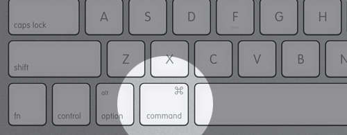
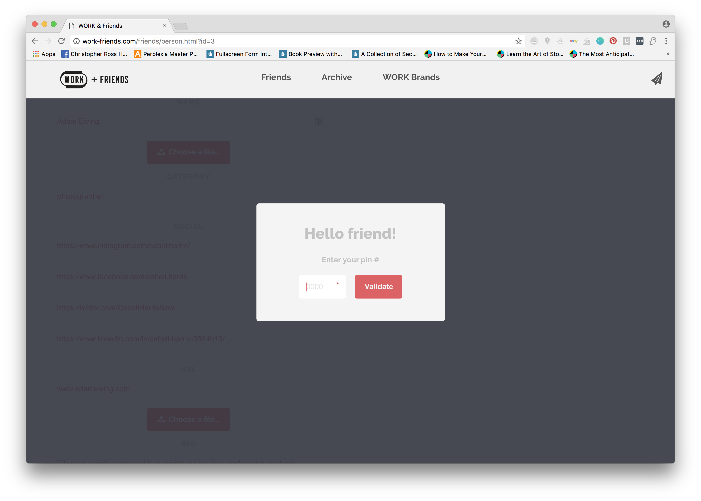
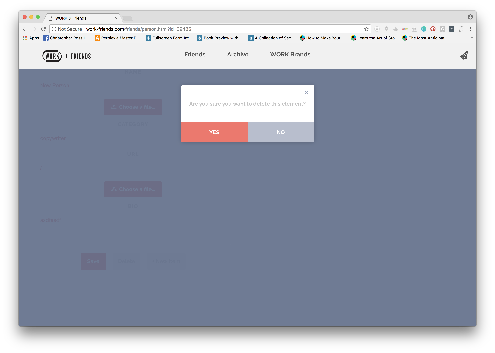
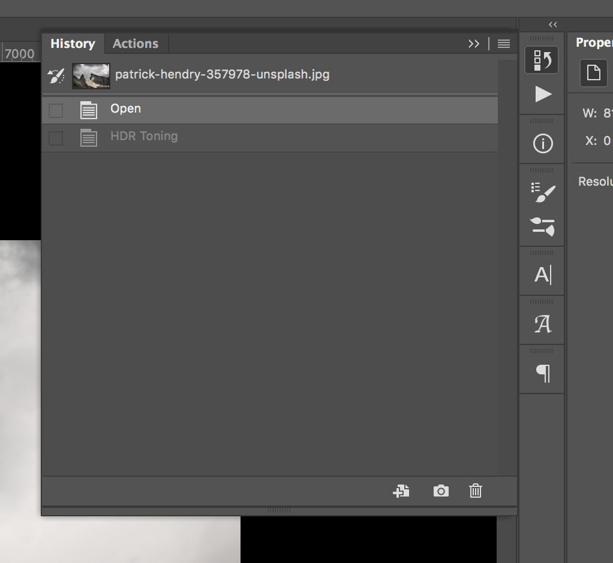

---

title: How To's
lang: en-US
meta:
  - name: description
    content: hello
  - name: keywords
    content: super duper SEO
sidebarDepth: 1
sidebar: auto
pageClass: custom-page-class
---
# How To's

## Updating WORK-Friends.com

::: tip
First clear your cache!
:::

### Editing Projects/Friends/Items

::: tip FYI
You can edit [friends](http://work-friends.com/friends/person.html?id=1), the [project item itself](http://work-friends.com/projects/project.html?id=1) (the top section), credit items, the extra images/videos below, or the carousels if it is a case study. (You can only have carousels if the project category = case-study)
:::

- Step 1: Go to the page you want to edit:

- Step 2: Unlock
  - Command + Click on the area you want to edit & enter the 4-digit passcode. (Hint: Monument Ave.)

- Step 3: Edit & Save
  - Edit the text and/or Upload an image then press save.

::: warning
When uploading files must be lowercase and have NO SPACES.
:::

### Adding Projects/Friends

- Step 1: Navigate
  - Go to the kind of page you want to add:

::: tip FYI
You can add [Project Pages](http://work-friends.com/projects/project.html?id=1)(the top section of a project page), [Friend Pages](http://work-friends.com/friends/person.html?id=1), credit items, the extra images/videos below, or the carousels if it is a case study. (You can only have carousels if the project category = case-study)
:::

- Step 2: Unlock

- Command + Click on the area you want to edit & enter the 4-digit passcode. (Hint: Monument Ave.)

- Step 3: Add Item
  - Click New Item
  - Edit the text and/or Upload an image then press save.

::: warning
When uploading files must be lowercase and have NO SPACES.
:::

::: tip FYI
If you add a credit item and the name does not match a friend that already exist, then a new friends will be made. Make sure you go to their page and edit the placeholder information.
:::

### Deleting Projects/Friends/Items
- Step 1: Navigate
  - Go to the page or item you want to delete:

  

- Step 2: Unlock
  - Command + Click on the area you want to edit & enter the 4-digit passcode. (Hint: Monument Ave.)

  

- Step 3: Delete
  - Click the delete button towards the bottom

  - Click yes to remove from the site.
  ::: danger THIS ACTION IS FINAL
  You will not be able to undo this!
  :::

  

## HDR Effect

### Applying Effect to Existing Image

::: tip FYI
This requires access to [Adobe Photoshop CC](https://accounts.adobe.com/). Log in with cabell@worklabs.com . Password can be found on [Last Pass](http://lastpass.com). Master password can be found in Metal Box behind Audrey's desk.
:::

- Step 1: Open Image in Photoshop
  - Go to Image > Mode to make sure it is set at RGB
  - Go to Image > Adjustments > HDR Toning
  - Select Scott 5 Preset and click OK

- Step 2: Make sure you have your Move tool selected (V)
  - Click on the image or select layer
  - Select All (Command + A)
  - Copy (Command + C)

- Step 3: Go to Window > History
  - Go back in time by clicking open at the top
  - Paste (Command + V)

- Step 4: Go to Window > Layers
  - Reduce the opacity of the pasted layer to 33%
  - Set blending mode to Luminosity

- Step 5: Unlock background layer by double clicking and hitting ok
  - Duplicated the background layer above the pasted layer
  - Reduce the opacity of the pasted layer to 33%
  - Go to Filter > Camera Raw Filter  (Command + Shift + A)
  - Set Clarity to 100% and hit OK

  ::: tip
  You can adjust the opacity settings and/or add layer masks to reduce to effects
  :::

- Step 6: Go to File > Save (Command + S)
  - Save your file to the appropriate project/artwork folder on the server

  ::: warning
  Don't save to your desktop!
  :::

## Server

### Connecting

### Back Up

## Printing

### Large Format

### Letter & Tabloid

## Scanning

### High-Res

### Low-Res
